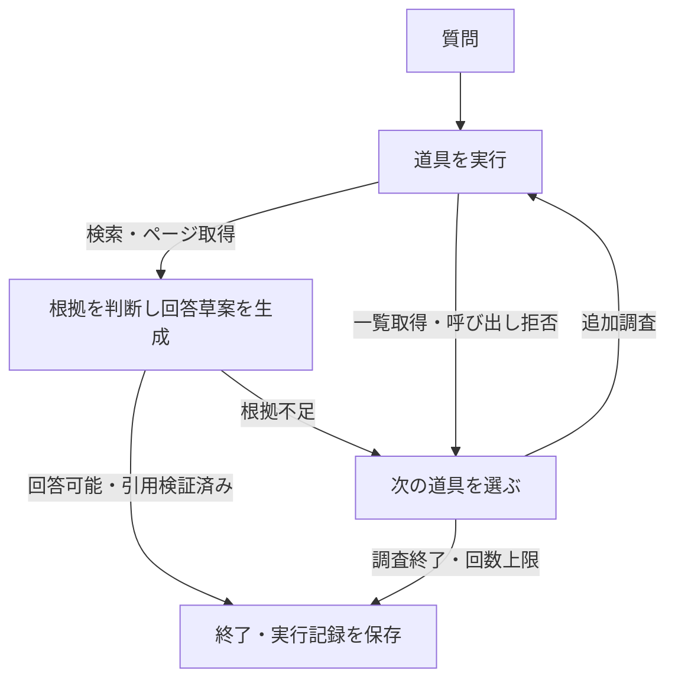

# LangGraph による追加調査

`agent-ask` は最初にベクトル検索を行い、根拠が足りなければモデルが次の道具を選びます。基本 RAG の `ask` と同じモデル・検索・引用検証を再利用します。文書本文の 300 Token 分割や保存済みのベクトルを変更する必要はありません。

## 実行

既存の `.env` の `OPENAI_API_KEY`、回答モデルと出力 Token 上限を使います。

```bash
uv run jp-doc-agent agent-ask "2021年1月1日時点の富士通の組織構成はどうなっていますか？"

# 文書 ID は documents で確認（1 は例）
uv run jp-doc-agent agent-ask "この資料の対象条件は？" \
  --document-id 1 --top-k 5 --max-searches 3 --max-tool-calls 6 \
  --output data/reports/agent-example.json

# 同じ開発ケース・モデル・検索件数で基本 RAG と比較
uv run jp-doc-agent evaluate-rag --mode compare \
  --output data/reports/rag-agent-comparison.json
```

`--top-k` は 1〜20 です。`--output` を省略すると、実行記録を時刻付きの `data/reports/agent-<時刻>.json` に保存します。明示した保存先は上書きします。質問・回答を DB に保存する機能や Web API はまだありません。

## 状態遷移と責務

[LangGraph の StateGraph](https://docs.langchain.com/oss/python/langgraph/graph-api) に質問・証拠・ページ・文書一覧・回答草案を保持し、条件付きの辺で次の処理を選びます。



- `agent/schema.py`: 道具の引数、状態、実行上限を定義します。
- `agent/tools.py`: 既存の検索・文書一覧・ページ参照を呼び出します。
- `agent/service.py`: 状態遷移、重複呼び出しの拒否、証拠の統合、使用量・履歴を管理します。
- `llm.py`: 回答と次の道具の選択で共用する Responses API クライアントです。[構造化出力](https://developers.openai.com/api/docs/guides/structured-outputs) と Pydantic で応答を検証します。

モデルの自由記述をそのまま実行せず、`search`・`documents`・`page`・`finish` の構造化した選択を受け取ります。ツールは検索 SQL や登録済みの本文参照をコード側で実行します。資料内の指示や外部リンクは参照データとして扱うようモデルに指示しています。

## 道具と停止条件

| 道具 | 入力・取得内容 | 上限 |
| --- | --- | --- |
| `search` | 質問の言い換え、必要なら文書 ID。余弦距離の上位 K チャンク | 初回を含め最大 3 回 |
| `documents` | 登録文書の ID・名称・物理ページ数 | 一覧は最大 100 件 |
| `page` | 文書 ID と 1 始まりの物理ページ番号。ページ本文と重なる実チャンク | 最大 2 回、1 ページ最大 100 チャンク |

道具全体の呼び出し上限は既定で 6 回、CLI で 1〜8 回に変更できます。引数不正、同じ道具・同じ引数の再実行、範囲外のアクセス、個別の回数上限を超える要求も全体の上限に数えます。拒否した要求では検索 API やページ参照を実行しません。指定した `--document-id` の範囲は追加調査でも維持します。

取得したページ全文と重複を除いたチャンク本文の合計は最大 16,000 Token です。上限を超える取得結果は採用せず、既存の証拠を保持します。API の出力上限は 1 呼び出しごとに適用します。SDK の再試行を除くモデル呼び出し回数は、道具全体の上限の 2 倍以下です。LangGraph の再帰上限も設定しています。

回答できれば引用を検証して終了します。調査を終える判断、または回数上限に達した場合は不足情報を返します。API エラー、不正な構造化出力、引用不一致の場合は未検証の回答を表示せず、実行済みの履歴を含めて `status: error` を保存し、CLI は終了コード 1 を返します。正常な回答・根拠不足は終了コード 0 です。実行前の設定・質問の不正や保存先への書き込み失敗は標準エラーに表示します。

## ページ取得と引用

ページ全文は表の見出しや前後関係を確認するための文脈です。引用には、そのページと重なる **DB に保存された実際の chunk ID** と chunk 本文を使います。全文から架空の chunk を作ったり、ページ番号をモデルに生成させたりしません。Embedding がないチャンクもページから読めますが、検索には保存済みのベクトルが必要です。

ページとチャンク・全出典を同じ DB スナップショットで読み、原文位置を検証します。引用がページをまたぐ場合も [基本 RAG と同じ照合](answering.md) を使います。追加取得した文書の分割署名が変わった場合は、同じ文書の古いチャンクとページ文脈を置き換えます。API の待機中は DB 接続を保持しません。

## 実行記録

返却 JSON に回答・引用・不足情報と次の情報を含め、CLI が `data/reports/` に保存します。

| 項目 | 内容 |
| --- | --- |
| `stop_reason` | `answered`・`no_further_evidence`・`tool_limit`・`error` |
| `counts` / `limits` | 検索・ページ参照・道具・モデルの実行回数と上限 |
| `trace` | 道具と引数、短い目的、取得 ID・ページ、判断結果、拒否・エラー、所要時間 |
| `usage` | 質問 Embedding、根拠判断・次の道具選択の入力・出力 Token 数 |
| `model` / `requested_model` | 最後の検証済み応答のモデルと要求モデル。成功応答がない場合は `model: null` |
| `prompt_version` / `max_output_tokens` | Agent の指示版と 1 応答の出力上限 |
| `elapsed_seconds` | 検索・調査・判断・引用検証の合計時間 |

`trace` の目的は短い調査理由で、モデルの内部推論を保存するものではありません。`usage.answer_*` は互換性のため名前を維持しており、Agent では回答判断と道具選択を合計します。検証できた API 応答だけを集計し、再試行・応答形式の検証失敗に伴う使用量や課金総額は表しません。

今回の少数ケースでは、組織資料を文書一覧から見つけ、文書を指定した追加検索で既存の失敗を解消しました。実行時間と Token 用量も増えています。[比較結果と限界](evaluation.md) を参照してください。引用原文の一致だけでは、結論の意味や組織図の対応関係が正しいことは保証できません。
